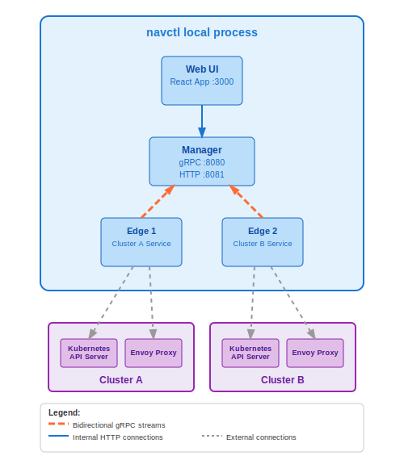

# Architecture

Navigator runs all components on your local machine or a dedicated server outside the cluster using the `navctl local` command.

## navctl local Architecture

**Characteristics:**
- **Single process**: Manager, multiple Edge instances, and UI run within one `navctl local` process
- **Multi-cluster support**: Each edge instance manages a different Kubernetes cluster
- **External access**: Connects to Kubernetes clusters via kubeconfig
- **Simple deployment**: No in-cluster permissions or resources required
- **Dynamic cluster switching**: Can add/remove clusters by updating kubeconfig contexts
- **Development friendly**: Ideal for development, testing, and lightweight production

**Use Cases:**
- Development and testing
- CI/CD environments  
- Small to medium deployments
- Situations where in-cluster deployment is restricted
- Multi-cluster management from a central location

## Core Components

### Manager Service
- **Central coordination hub** for all edge connections
- **Bidirectional streaming** - maintains persistent gRPC connections with edges
- **State aggregation** - consolidates cluster state from multiple sources
- **Query routing** - directs proxy configuration requests to appropriate edges
- **API gateway** - serves HTTP REST API for UI and external integrations

**Deployment:**
- Embedded in navctl process on ports 8080 (gRPC) and 8081 (HTTP)

### Edge Service  
- **Cluster connector** - interfaces with Kubernetes API servers
- **State synchronization** - streams services, pods, and endpoints to manager
- **Proxy analysis** - connects to Envoy admin APIs for configuration retrieval
- **Flexible deployment** - runs externally via kubeconfig

**Deployment:**
- Multiple edge instances embedded in navctl process, each using different kubeconfig contexts

### Web UI
- **Service discovery interface** - browse and inspect Kubernetes services
- **Proxy visualization** - view Envoy configurations in structured format  
- **Real-time updates** - live data from manager API
- **Multi-cluster view** - unified interface across all connected clusters
- **Service topology view** - visual service graph with metrics when available

**Deployment:**
- Embedded in navctl, served on port 3000

## Metrics Architecture

Navigator includes a comprehensive metrics subsystem that enables service-to-service communication visualization and performance monitoring.

### Core Metrics Components

#### Generic Provider Interface (`edge/pkg/metrics/`)
- **Abstract interface** design supports multiple metrics backends
- **Provider registration** system for pluggable metrics sources
- **Query abstraction** with standardized metrics data model
- **Connection management** with health checking and retry logic

#### Prometheus Provider (`edge/pkg/metrics/prometheus/`)
- **Complete Prometheus API client** implementation
- **Service graph queries** for request rate, error rate, and latency metrics
- **Time range support** with configurable query windows
- **Multi-cluster query aggregation** across federated Prometheus instances

#### Edge Metrics Integration
- **Capability reporting** - edges report metrics support to manager during startup
- **Periodic collection** - metrics gathered during regular cluster sync cycles
- **On-demand queries** - real-time metrics retrieval for UI requests
- **Provider health monitoring** - connection status tracking and error reporting

#### Manager Aggregation
- **Cross-cluster metrics** - aggregates service graphs from multiple edges
- **Capability tracking** - maintains metrics capability status per connected cluster
- **Query routing** - directs metrics requests to appropriate edges with capabilities
- **Unified API** - exposes consolidated metrics data through frontend API

#### Frontend Metrics API
- **Service graph endpoints** - RESTful API for topology data retrieval
- **Real-time queries** - supports configurable time ranges and refresh intervals
- **Cluster filtering** - metrics can be filtered by specific clusters or aggregated
- **Error handling** - graceful degradation when metrics providers are unavailable

### Metrics Data Flow

1. **Edge Configuration**: Edges detect and connect to configured metrics providers (Prometheus endpoints)
2. **Capability Reporting**: During startup, edges report their metrics capabilities to the manager
3. **Periodic Collection**: Edges query metrics providers during cluster state synchronization
4. **Data Transmission**: Service graph metrics are included in cluster sync messages to manager
5. **Manager Aggregation**: Manager consolidates metrics from multiple clusters and edges
6. **Frontend API**: HTTP gateway exposes metrics data through RESTful endpoints
7. **UI Consumption**: React components query metrics API for real-time topology visualization

### UI Behavior

#### Navigation Control
- **Conditional display**: Topology navigation only appears when edges report metrics capabilities
- **Mixed capability warning**: Visual indicators when some clusters have metrics and others don't
- **Graceful fallback**: No-metrics state screen provides guidance when metrics are unavailable

#### Service Graph Visualization
- **Tabular display**: Service-to-service communication shown in structured table format
- **Real-time updates**: Configurable refresh intervals from 5 seconds to manual refresh
- **Performance metrics**: Request rates, error rates displayed with color-coded indicators
- **Multi-cluster context**: Services tagged with originating cluster information

#### State Management
- **Capability detection**: Real-time checking of metrics availability across clusters
- **Loading states**: Progressive loading with skeleton UI during metrics queries
- **Error handling**: User-friendly error messages when metrics queries fail