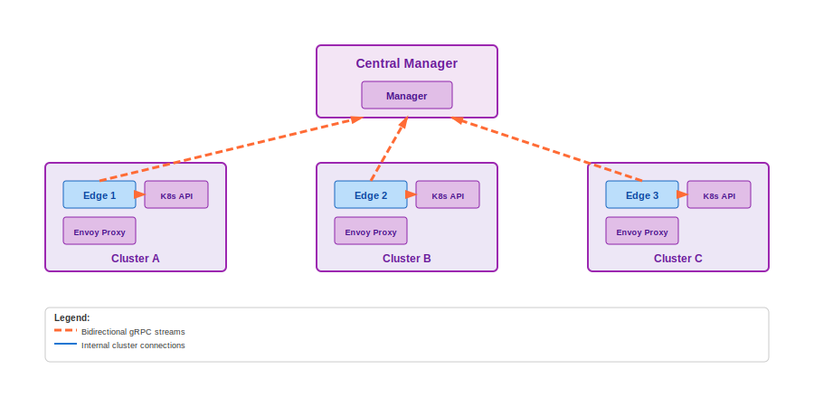

# Architecture

Navigator is built on an edge computing architecture where **Edge** processes connect to a central **Manager** through bidirectional streaming connections. This design enables real-time communication, data synchronization, and dynamic coordination between edge components.

## Core Architecture

## Component Roles

### Edges
- **Edge processes** that communicate with Kubernetes API servers
- **Flexible deployment** - can run external to cluster or as containers in-cluster
- **State synchronization** - sync high-level state of services, pods, and endpoint slices with the central manager
- **On-demand query responders** - provide additional information such as proxy configuration for individual proxies when requested by the management plane

### Manager
- **Central coordination point** for all edge processes
- **Connection orchestrator** managing multiple streaming connections
- **High-level state aggregator** - maintains consolidated view of services, pods, and endpoint slices across clusters
- **Query initiator** - requests detailed information (like proxy configurations) from edges when needed
- **Scalable data management** - stores lightweight state centrally while keeping detailed data distributed at the edges
